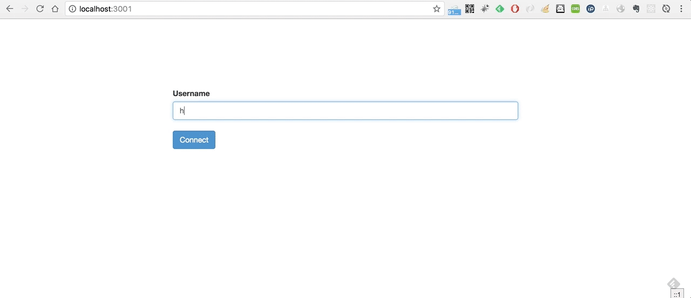

[](https://hub.docker.com/r/samurais/ss-spa/) [](https://hub.docker.com/r/samurais/ss-spa/) [](https://microbadger.com/#/images/samurais/ss-spa)
[](https://microbadger.com/images/samurais/ss-spa "Get your own version badge on microbadger.com")

# Welcome


SuperScript Single Page Application is 

* Easy to bootstrap SuperScript.
* Embrace WeakAI in minutes.
* Adopt chatbot quickly.

## Deps

Node.js v7.1.6+ (leverage async/await)
MongoDB

## Usage
```
git clone https://github.com/Samurais/ss-spa.git
cd ss-spa
npm install
bower install
cp config/environment/development.sample.js config/environment/development.js
cp config/log4js.sample.json config/log4js.json
npm start
open http://localhost:3001
```

## Watch
Re-parse and restart app when editing chat's scripts.
```
npm run dev:start
```

> Note, in the browser, socket.io would reconnect to server when the app is restarted, it avoids reloading client page.


## Test
```
npm run dev:start
npm test
```

> npm test  -- --watch # to run testcase lively.

# Thanks to

[WebRTC chat with React.js](http://blog.mgechev.com/2014/09/03/webrtc-peer-to-peer-chat-with-react/)

[SuperScript](http://superscriptjs.com/)


# Docker
To start app with docker-compose.
```
docker pull tutum/mongodb:3.2
docker pull samurais/hanlp-api:1.0.0
docker pull samurais/ss-spa:0.0.1
./scripts/start-with-docker.sh
open http://localhost:3001
```

Note, **samurais/ss-spa:0.0.1** can be built locally.
```
./scripts/build-docker-image.sh
```

# License
MIT
